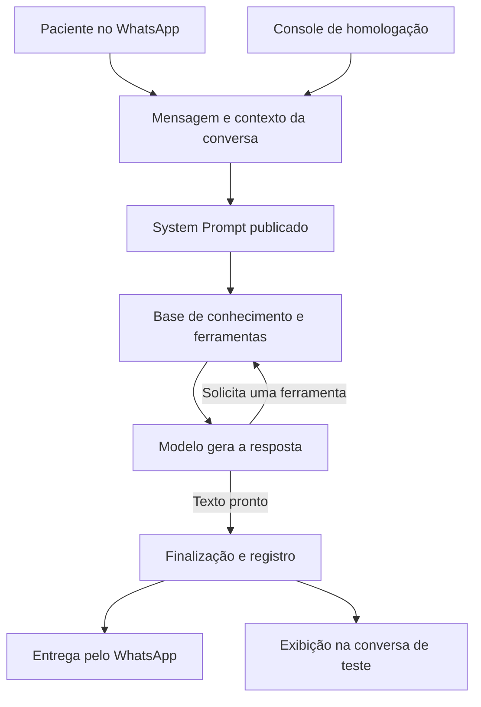

# Resposta direta da Nina

O núcleo `gerarRespostaNina`, compartilhado pelo WhatsApp e pelo console de homologação, entrega as informações do modelo sem avaliação do motor de confiança. A mudança vale para todas as clínicas, independentemente da etapa ou configuração antiga do motor.

## O que sai do atendimento

- Avaliação de segurança da ação pelo motor e seu pré-commit configurável.
- Avaliação factual e de cumprimento do prompt depois da geração.
- Notas, níveis, decisões ALLOW/CLARIFY/BLOCK/HANDOFF e reescritas decorrentes dessas avaliações.
- Transferência automática por baixa pontuação ou falha do avaliador.
- Instrução adicional de esclarecimento herdada de uma pendência do motor antigo.
- Selo da mensagem, seção de confiança dos detalhes técnicos, filtros, painéis e calibração ativos do motor.

## O que continua no fluxo

O modelo recebe o prompt publicado, o contexto da conversa e os retornos da base. Pode solicitar ferramentas e atendimento humano conforme as instruções. A finalização mantém os templates operacionais e o registro do texto final.

As regras próprias das operações continuam: identificação e confirmação para agendar, autorização para consultar vagas, validação de parâmetros, acesso à clínica correta, confirmação de gravação de agendamento, idempotência, reserva do turno e watchdog. Esses controles não calculam uma nota de confiabilidade da resposta informativa.

O envio real usa a Meta; a homologação registra a mensagem no console. Os adaptadores mantêm seus controles de entrega e isolamento. Os testes não enviam mensagens a pacientes.

## Detalhes e histórico

Os detalhes continuam mostrando mensagem, prompt, modelo, consultas, ferramentas, transformações e entrega. Não consultam `nina_confianca_decisoes`. Eventos e campos do avaliador antigo são omitidos da apresentação, sem alterar os registros originais.

O registro de entrega foi separado em `entrega-saida.server.ts`: utiliza a tabela existente de vínculos, sem buscar avaliação e com `decisao_id` nulo. Não há migração ou exclusão de histórico. Utilitários de catálogo, hash e identidade que já estavam na pasta `confidence` continuam sendo reutilizados; os avaliadores não são chamados pelo atendimento.

## Validação e publicação

A versão do núcleo passa a ser `nina-resposta-direta-20260916-v1`. A suíte `resposta-direta.test.ts` executa o núcleo real com banco, modelo e catálogo simulados, nos dois ambientes. Confere preservação do texto, envio do prompt e dos dados da base, uma chamada ao modelo e nenhuma execução do avaliador, consulta de política ou gravação de nota.

As suítes de inspeção, transporte, protocolo, agrupamento, watchdog e agendamento também integram a validação. Publicar o código é necessário para que o novo fluxo entre em uso nos ambientes implantados. A versão e o fingerprint registrados em cada turno permitem conferir qual código produziu cada resposta.

Validação local de 16/09/2026: 3.505 testes aprovados na suíte de regressão, nenhuma falha e 25 testes de infraestrutura ignorados; mais dois testes de filtragem dos detalhes aprovados. O teste do núcleo também confirmou gravação de entrega sem herdar decisão antiga. Typecheck e build aprovados. Para o build no Windows foi necessário normalizar temporariamente os caminhos na dependência instalada `@lovable.dev/mcp-js`; o arquivo foi restaurado ao final e esse ajuste não integra a alteração. O lint dos arquivos principais ainda aponta ocorrências preexistentes, sem ocorrências nas linhas modificadas.

Rollback: restaurar os arquivos desta alteração e publicar novamente. Os dados históricos e as estruturas do banco permanecem disponíveis.
